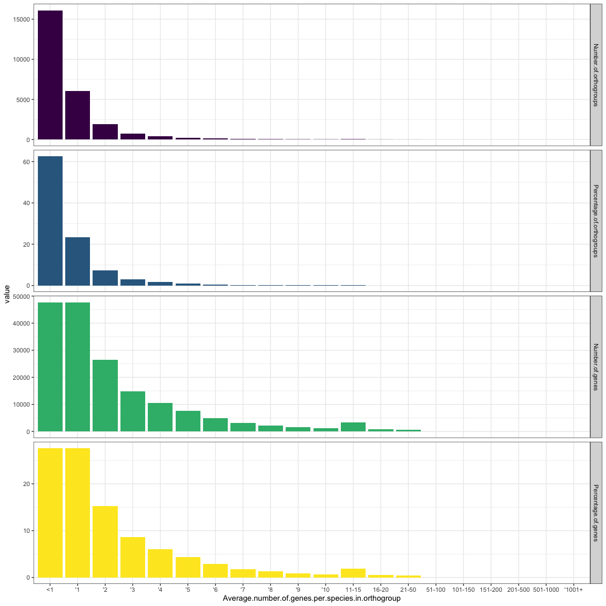
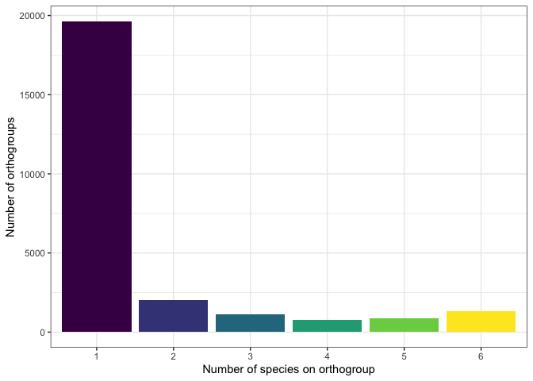
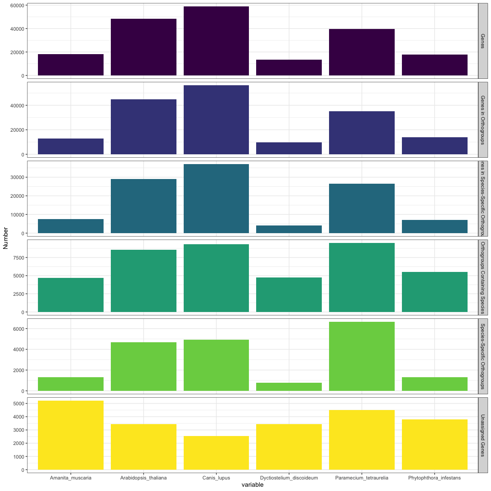
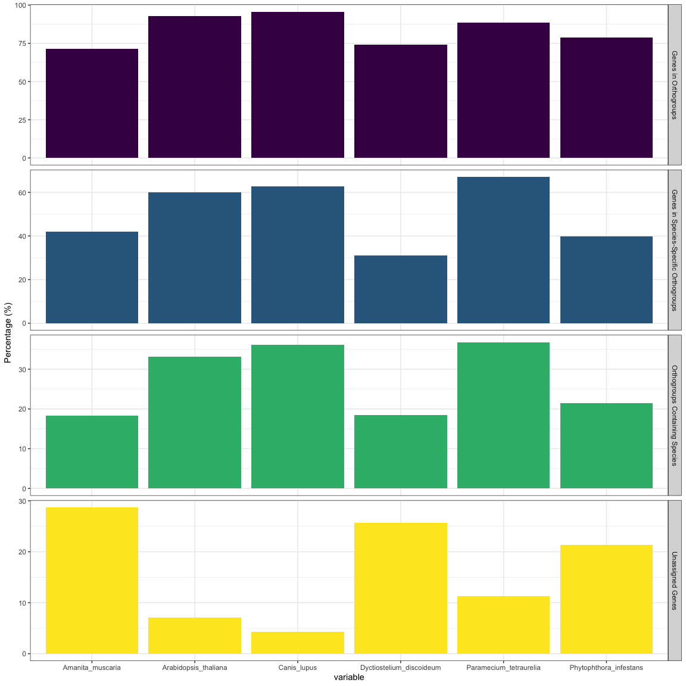
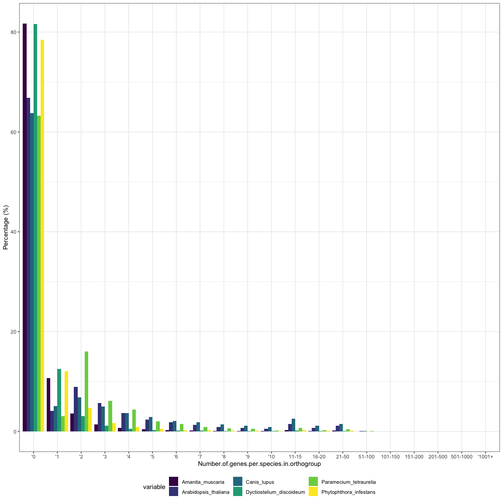
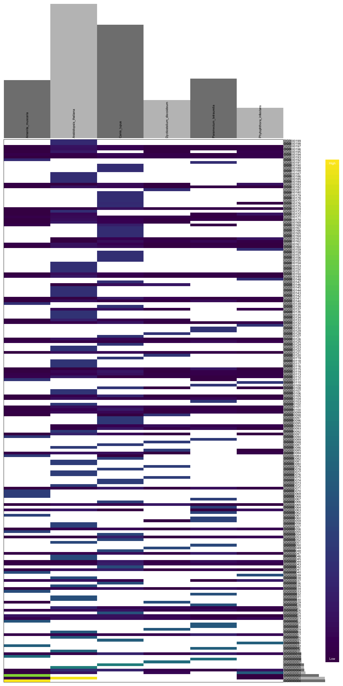
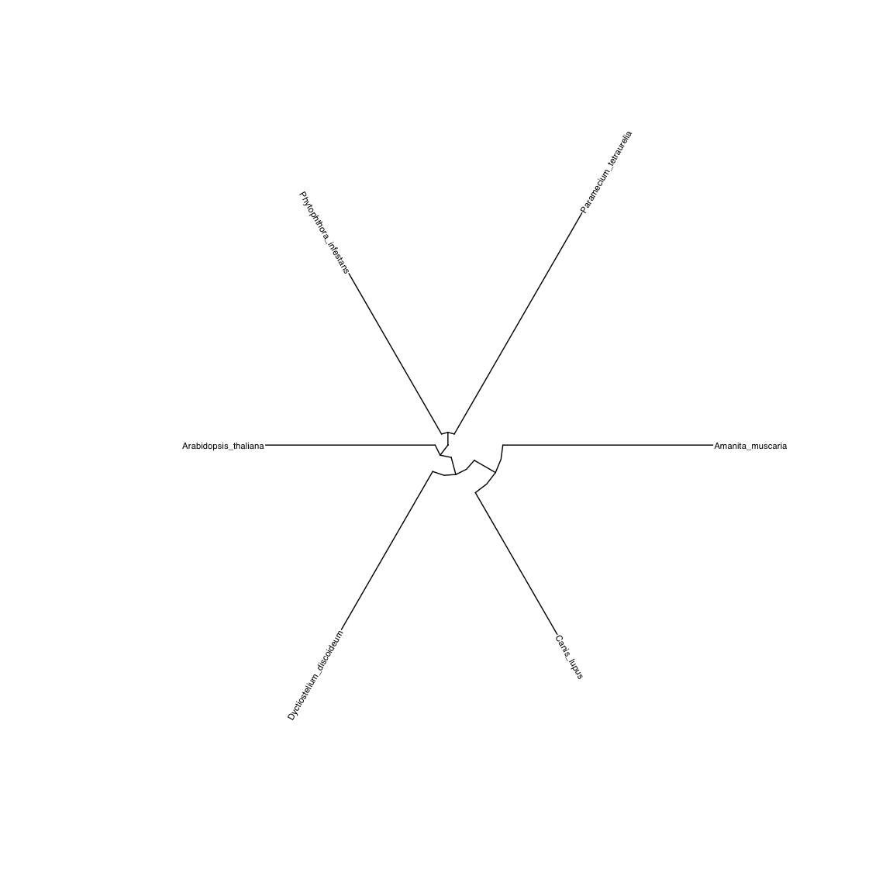

OrthoFinder tutorial for BUG
================
Javier F. Tabima
February 12, 2020

  - [Objectives](#objectives)
  - [Data sets](#data-sets)
  - [Procedure](#procedure)
      - [Obtaining data](#obtaining-data)
      - [Summary of data](#summary-of-data)
  - [Downloading Orthofinder](#downloading-orthofinder)
  - [Running OrthoFinder](#running-orthofinder)
  - [OrthoFinder results](#orthofinder-results)
      - [Statistics Overall](#statistics-overall)
          - [Section 1: Overall statistics (Lines 1 to
            24)](#section-1-overall-statistics-lines-1-to-24)
          - [Section 2: Genes per Orthogroup (Lines
            26-45)](#section-2-genes-per-orthogroup-lines-26-45)
          - [Section 3: Species per Orthogroup (Lines
            47-54)](#section-3-species-per-orthogroup-lines-47-54)
      - [Statistics per Species](#statistics-per-species)
          - [Section 1: Overall statistics (Lines 1 to
            24)](#section-1-overall-statistics-lines-1-to-24-1)
          - [Section 2. Per species- per ortholog statistics (Lines 14
            to
            56)](#section-2.-per-species--per-ortholog-statistics-lines-14-to-56)
      - [The count of genes per **Orthogroup** predicted by
        OrthoFinder](#the-count-of-genes-per-orthogroup-predicted-by-orthofinder)
          - [Questions (Section 3):](#questions-section-3-1)
      - [The **Single copy orthologs** and the **Species
        Tree**](#the-single-copy-orthologs-and-the-species-tree)
          - [The **Single copy orthologs**](#the-single-copy-orthologs)
          - [The **Species tree **](#the-species-tree)

-----

# Objectives

Assessments of homology using genomic data allow for the identification
of genes under selection, expansion or reduction of genic families,
analysis of presence or absence of important genes, and identification
of core genes across different taxonomic levels. These assays based on
orthologous gene searches come in different flavors, and many tools have
been created to identify homologous genes across different genomes
(e.g. OrthoMCL, InParanoid, FastOrtho, etc).

In this tutorial we will focus on OrthoFinder (Emms et al. 2015;
<https://genomebiology.biomedcentral.com/articles/10.1186/s13059-015-0721-2>),
a fast and simple software focused on phylogenetic orthology inference.
We will focus on the basics of this program, how to run it in the
cluster, and how to interpret results to identify core homologous genes,
genic duplication and how OrthoFinder reconstructs species trees based
on orthologous gene data.

-----

# Data sets

OrthoFinder uses **protein sequences** in FASTA format and it performs
optimally on protein sequences predicted from whole genome sequences.
For this tutorial we want to explore orthology across the Eukaryotic
tree of life. We will use **six different species across the tree of
life**:

  - [*Canis lupus*
    (Dog)](ftp://ftp.ncbi.nlm.nih.gov/genomes/all/GCF/000/002/285/GCF_000002285.3_CanFam3.1/GCF_000002285.3_CanFam3.1_protein.faa.gz)
  - [*Amanita muscaria* (Fly
    agaric)](ftp://ftp.ncbi.nlm.nih.gov/genomes/all/GCA/000/827/485/GCA_000827485.1_Amanita_muscaria_Koide_BX008_v1.0/GCA_000827485.1_Amanita_muscaria_Koide_BX008_v1.0_protein.faa.gz)
  - [*Phytophthora infestans* (Late blight of potato and
    tomato)](ftp://ftp.ncbi.nlm.nih.gov/genomes/all/GCF/000/142/945/GCF_000142945.1_ASM14294v1/GCF_000142945.1_ASM14294v1_protein.faa.gz)
  - [*Arabidopsis thaliana* (thale
    cress)](ftp://ftp.ncbi.nlm.nih.gov/genomes/all/GCF/000/001/735/GCF_000001735.4_TAIR10.1/GCF_000001735.4_TAIR10.1_protein.faa.gz)
  - [*Dyctiostelium discoideum* (Cellular slime
    mold)](ftp://ftp.ncbi.nlm.nih.gov/genomes/all/GCF/000/004/695/GCF_000004695.1_dicty_2.7/GCF_000004695.1_dicty_2.7_protein.faa.gz)
  - [*Paramecium
    tetraurelia*](ftp://ftp.ncbi.nlm.nih.gov/genomes/all/GCF/000/165/425/GCF_000165425.1_ASM16542v1/GCF_000165425.1_ASM16542v1_protein.faa.gz)

-----

# Procedure

## Obtaining data

1.  Download all of the samples to a folder in the cluster. The folder
    can be any folder that you have access to. In my case, I’ll download
    everything in my `home/` folder

<!-- end list -->

    cd ~
    mkdir orthofinder_test
    cd orthofinder_test

2.  To download these files into the structure you can either download
    them all separately or one by one. Here are the commands I use:

<!-- end list -->

    SGE_Batch -c 'curl ftp://ftp.ncbi.nlm.nih.gov/genomes/all/GCF/000/002/285/GCF_000002285.3_CanFam3.1/GCF_000002285.3_CanFam3.1_protein.faa.gz > Canis_lupus.fasta.gz' -r curl_1
    SGE_Batch -c 'curl ftp://ftp.ncbi.nlm.nih.gov/genomes/all/GCA/000/827/485/GCA_000827485.1_Amanita_muscaria_Koide_BX008_v1.0/GCA_000827485.1_Amanita_muscaria_Koide_BX008_v1.0_protein.faa.gz > Amanita_muscaria.fasta.gz' -r curl_2
    SGE_Batch -c 'curl ftp://ftp.ncbi.nlm.nih.gov/genomes/all/GCF/000/142/945/GCF_000142945.1_ASM14294v1/GCF_000142945.1_ASM14294v1_protein.faa.gz  > Phytophthora_infestans.fasta.gz' -r curl_3
    SGE_Batch -c 'curl ftp://ftp.ncbi.nlm.nih.gov/genomes/all/GCF/000/001/735/GCF_000001735.4_TAIR10.1/GCF_000001735.4_TAIR10.1_protein.faa.gz > Arabidopsis_thaliana.fasta.gz' -r curl_4
    SGE_Batch -c 'curl ftp://ftp.ncbi.nlm.nih.gov/genomes/all/GCF/000/004/695/GCF_000004695.1_dicty_2.7/GCF_000004695.1_dicty_2.7_protein.faa.gz > Dyctiostelium_discoideum.fasta.gz' -r curl_5
    SGE_Batch -c 'curl ftp://ftp.ncbi.nlm.nih.gov/genomes/all/GCF/000/165/425/GCF_000165425.1_ASM16542v1/GCF_000165425.1_ASM16542v1_protein.faa.gz > Paramecium_tetraurelia.fasta.gz' -r curl_6

3.  Decompress the fasta files

<!-- end list -->

    SGE_Batch -c 'bash; for i in *.gz; do gunzip $i; done' -r gunzip

4.  Remove all the unnecessary files

<!-- end list -->

    rm -rf curl_*/
    rm -rf gunzip/

## Summary of data

To estimate the number of proteins per downloaded genome we can count
the number of sequences in each of the FASTA files we downloaded. To do
so you can count the number of `>` characters per file. This is how I
would do it:

    for i in *.fasta; do a=$(grep -c ">" $i); printf $i"\t"$a"\n"; done

The results should look like this:

| FASTA file                      | Number of proteins |
| ------------------------------- | ------------------ |
| Amanita\_muscaria.fasta         | 18,093             |
| Arabidopsis\_thaliana.fasta     | 48,265             |
| Canis\_lupus.fasta              | 58,774             |
| Dyctiostelium\_discoideum.fasta | 13,315             |
| Paramecium\_tetraurelia.fasta   | 39,580             |
| Phytophthora\_infestans.fasta   | 17,797             |

# Downloading Orthofinder

  - Download the latest OrthoFinder.tar.gz release from github:

<!-- end list -->

    cd ~
    wget https://github.com/davidemms/OrthoFinder/releases/latest/download/OrthoFinder.tar.gz

  - Extract the files:

<!-- end list -->

    tar xzf OrthoFinder.tar.gz

  - Test OrthoFinder:

<!-- end list -->

    cd OrthoFinder/
    ./orthofinder -h

If OrthoFinder works correctly, OrthoFinder should print its ‘help’
text.

# Running OrthoFinder

For this example, we will run OrthoFinder using the default settings.
One of the greatest advantages of OrthoFinder is that the only input it
requires is the folder where the FASTA sequences are. In our case, the
FASTA aminoacid files are contained in the `~/orthofinder_test` folder.
*Make sure you have the absolute path of your folder. In my example, the
path is* `/raid1/home/bpp/tabimaj/orthofinder_test`

So, to run OrthoFinder while in the `~/OrthoFinder/` folder, you can run
the analysis using the following command by requesting 6
processors/slots from the CGRB cluster:

    SGE_Batch -c './orthofinder -f /raid1/home/bpp/tabimaj/orthofinder_test -t 8' -P 8 -r BUG_orthofinder 

# OrthoFinder results

The run of OrthoFinder took 2h 20mins using eight threads at the CGRB
infrastructure. The host which was OrthoFinder ran at was `symbiosis`.

The results of your personal OrthoFinder run should be found in the
`~/orthofinder_test/Results_Feb12/` folder. For an example run, I have a
folder that will CGRB users read the files from an identical OrthoFinder
folder at
`/raid1/home/bpp/tabimaj/orthofinder_test/OrthoFinder/Results_Feb06_1`

While I recommend you to go to the [OrthoFinder
webpage](https://github.com/davidemms/OrthoFinder) to understand what
files and results come as output from the program, we will focus in four
main results today:

  - The **Statistics Overall** file
  - The **Statistics Per Species** file
  - The count of genes per **Orthogroup** predicted by OrthoFinder
  - The **Single copy orthologs** and the **Species Tree**

## Statistics Overall

> Location:
> `/raid1/home/bpp/tabimaj/orthofinder_test/OrthoFinder/Results_Feb06_1/Comparative_Genomics_Statistics/Statistics_Overall.tsv`

The **Statistics Overall** file is a tab-separated text file that
contains general statistics about orthogroup sizes and proportion of
genes assigned to orthogroups.

As mentioned by the [OrthoFinder
webpage](https://github.com/davidemms/OrthoFinder):

> Most of the terms in the files ‘Statistics\_Overall.csv’ and
> ‘Statistics\_PerSpecies.csv’ are self-explanatory, the remainder are
> defined below.

> Species-specific orthogroup: An orthogroups that consist entirely of
> genes from one species.

> G50: The number of genes in the orthogroup such that 50% of genes are
> in orthogroups of that size or larger.

> O50: The smallest number of orthogroups such that 50% of genes are in
> orthogroups of that size or larger.

> Single-copy orthogroup: An orthogroup with exactly one gene (and no
> more) from each species. These orthogroups are ideal for inferring a
> species tree and many other analyses.

> Unassigned gene: A gene that has not been put into an orthogroup with
> any other genes.

Lets take a look at the file. Even if this is a “tab-separated” file, we
need to split it on sections:

#### Section 1: Overall statistics (Lines 1 to 24)

``` r
library(magrittr)
library(knitr)
library(kableExtra)

knitr::kable(read.table("Results/Statistics_Overall.tsv",fill = T, nrows = 24, sep = "\t")) %>%
 kable_styling(bootstrap_options = c("striped", "hover", "condensed", "responsive"))
```

<table class="table table-striped table-hover table-condensed table-responsive" style="margin-left: auto; margin-right: auto;">

<thead>

<tr>

<th style="text-align:left;">

V1

</th>

<th style="text-align:left;">

V2

</th>

</tr>

</thead>

<tbody>

<tr>

<td style="text-align:left;">

Number of species

</td>

<td style="text-align:left;">

6

</td>

</tr>

<tr>

<td style="text-align:left;">

Number of genes

</td>

<td style="text-align:left;">

195824

</td>

</tr>

<tr>

<td style="text-align:left;">

Number of genes in orthogroups

</td>

<td style="text-align:left;">

172946

</td>

</tr>

<tr>

<td style="text-align:left;">

Number of unassigned genes

</td>

<td style="text-align:left;">

22878

</td>

</tr>

<tr>

<td style="text-align:left;">

Percentage of genes in orthogroups

</td>

<td style="text-align:left;">

88.3

</td>

</tr>

<tr>

<td style="text-align:left;">

Percentage of unassigned genes

</td>

<td style="text-align:left;">

11.7

</td>

</tr>

<tr>

<td style="text-align:left;">

Number of orthogroups

</td>

<td style="text-align:left;">

25731

</td>

</tr>

<tr>

<td style="text-align:left;">

Number of species-specific orthogroups

</td>

<td style="text-align:left;">

19632

</td>

</tr>

<tr>

<td style="text-align:left;">

Number of genes in species-specific orthogroups

</td>

<td style="text-align:left;">

111223

</td>

</tr>

<tr>

<td style="text-align:left;">

Percentage of genes in species-specific orthogroups

</td>

<td style="text-align:left;">

56.8

</td>

</tr>

<tr>

<td style="text-align:left;">

Mean orthogroup size

</td>

<td style="text-align:left;">

6.7

</td>

</tr>

<tr>

<td style="text-align:left;">

Median orthogroup size

</td>

<td style="text-align:left;">

4.0

</td>

</tr>

<tr>

<td style="text-align:left;">

G50 (assigned genes)

</td>

<td style="text-align:left;">

10

</td>

</tr>

<tr>

<td style="text-align:left;">

G50 (all genes)

</td>

<td style="text-align:left;">

9

</td>

</tr>

<tr>

<td style="text-align:left;">

O50 (assigned genes)

</td>

<td style="text-align:left;">

4442

</td>

</tr>

<tr>

<td style="text-align:left;">

O50 (all genes)

</td>

<td style="text-align:left;">

5664

</td>

</tr>

<tr>

<td style="text-align:left;">

Number of orthogroups with all species present

</td>

<td style="text-align:left;">

1319

</td>

</tr>

<tr>

<td style="text-align:left;">

Number of single-copy orthogroups

</td>

<td style="text-align:left;">

32

</td>

</tr>

<tr>

<td style="text-align:left;">

Date

</td>

<td style="text-align:left;">

2020-02-06

</td>

</tr>

<tr>

<td style="text-align:left;">

Orthogroups file

</td>

<td style="text-align:left;">

Orthogroups.tsv

</td>

</tr>

<tr>

<td style="text-align:left;">

Unassigned genes file

</td>

<td style="text-align:left;">

Orthogroups\_UnassignedGenes.tsv

</td>

</tr>

<tr>

<td style="text-align:left;">

Per-species statistics

</td>

<td style="text-align:left;">

Statistics\_PerSpecies.tsv

</td>

</tr>

<tr>

<td style="text-align:left;">

Overall statistics

</td>

<td style="text-align:left;">

Statistics\_Overall.tsv

</td>

</tr>

<tr>

<td style="text-align:left;">

Orthogroups shared between species

</td>

<td style="text-align:left;">

Orthogroups\_SpeciesOverlaps.tsv

</td>

</tr>

</tbody>

</table>

##### Questions (Section 1):

1.  What is the number of *orthogroups that consist entirely of genes
    from one species*? Is it the majority of data? What percentage of
    the orthogroups is is?

2.  What is the number of *single-copy orthogroups* found in the
    analysis? What does this mean biologically?

#### Section 2: Genes per Orthogroup (Lines 26-45)

``` r
genes_per_OG <- read.delim("Results/Statistics_Overall.tsv",fill = T, skip = 25, nrows = 20, sep = "\t")
kable(genes_per_OG) %>% kable_styling(bootstrap_options = c("striped", "hover", "condensed", "responsive"))
```

<table class="table table-striped table-hover table-condensed table-responsive" style="margin-left: auto; margin-right: auto;">

<thead>

<tr>

<th style="text-align:left;">

Average.number.of.genes.per.species.in.orthogroup

</th>

<th style="text-align:right;">

Number.of.orthogroups

</th>

<th style="text-align:right;">

Percentage.of.orthogroups

</th>

<th style="text-align:right;">

Number.of.genes

</th>

<th style="text-align:right;">

Percentage.of.genes

</th>

</tr>

</thead>

<tbody>

<tr>

<td style="text-align:left;">

\<1

</td>

<td style="text-align:right;">

16108

</td>

<td style="text-align:right;">

62.6

</td>

<td style="text-align:right;">

47651

</td>

<td style="text-align:right;">

27.6

</td>

</tr>

<tr>

<td style="text-align:left;">

’1

</td>

<td style="text-align:right;">

6015

</td>

<td style="text-align:right;">

23.4

</td>

<td style="text-align:right;">

47718

</td>

<td style="text-align:right;">

27.6

</td>

</tr>

<tr>

<td style="text-align:left;">

’2

</td>

<td style="text-align:right;">

1887

</td>

<td style="text-align:right;">

7.3

</td>

<td style="text-align:right;">

26446

</td>

<td style="text-align:right;">

15.3

</td>

</tr>

<tr>

<td style="text-align:left;">

’3

</td>

<td style="text-align:right;">

737

</td>

<td style="text-align:right;">

2.9

</td>

<td style="text-align:right;">

14887

</td>

<td style="text-align:right;">

8.6

</td>

</tr>

<tr>

<td style="text-align:left;">

’4

</td>

<td style="text-align:right;">

399

</td>

<td style="text-align:right;">

1.6

</td>

<td style="text-align:right;">

10460

</td>

<td style="text-align:right;">

6.0

</td>

</tr>

<tr>

<td style="text-align:left;">

’5

</td>

<td style="text-align:right;">

236

</td>

<td style="text-align:right;">

0.9

</td>

<td style="text-align:right;">

7651

</td>

<td style="text-align:right;">

4.4

</td>

</tr>

<tr>

<td style="text-align:left;">

’6

</td>

<td style="text-align:right;">

130

</td>

<td style="text-align:right;">

0.5

</td>

<td style="text-align:right;">

4987

</td>

<td style="text-align:right;">

2.9

</td>

</tr>

<tr>

<td style="text-align:left;">

’7

</td>

<td style="text-align:right;">

70

</td>

<td style="text-align:right;">

0.3

</td>

<td style="text-align:right;">

3103

</td>

<td style="text-align:right;">

1.8

</td>

</tr>

<tr>

<td style="text-align:left;">

’8

</td>

<td style="text-align:right;">

45

</td>

<td style="text-align:right;">

0.2

</td>

<td style="text-align:right;">

2268

</td>

<td style="text-align:right;">

1.3

</td>

</tr>

<tr>

<td style="text-align:left;">

’9

</td>

<td style="text-align:right;">

28

</td>

<td style="text-align:right;">

0.1

</td>

<td style="text-align:right;">

1569

</td>

<td style="text-align:right;">

0.9

</td>

</tr>

<tr>

<td style="text-align:left;">

’10

</td>

<td style="text-align:right;">

21

</td>

<td style="text-align:right;">

0.1

</td>

<td style="text-align:right;">

1297

</td>

<td style="text-align:right;">

0.7

</td>

</tr>

<tr>

<td style="text-align:left;">

11-15

</td>

<td style="text-align:right;">

44

</td>

<td style="text-align:right;">

0.2

</td>

<td style="text-align:right;">

3353

</td>

<td style="text-align:right;">

1.9

</td>

</tr>

<tr>

<td style="text-align:left;">

16-20

</td>

<td style="text-align:right;">

8

</td>

<td style="text-align:right;">

0.0

</td>

<td style="text-align:right;">

880

</td>

<td style="text-align:right;">

0.5

</td>

</tr>

<tr>

<td style="text-align:left;">

21-50

</td>

<td style="text-align:right;">

3

</td>

<td style="text-align:right;">

0.0

</td>

<td style="text-align:right;">

676

</td>

<td style="text-align:right;">

0.4

</td>

</tr>

<tr>

<td style="text-align:left;">

51-100

</td>

<td style="text-align:right;">

0

</td>

<td style="text-align:right;">

0.0

</td>

<td style="text-align:right;">

0

</td>

<td style="text-align:right;">

0.0

</td>

</tr>

<tr>

<td style="text-align:left;">

101-150

</td>

<td style="text-align:right;">

0

</td>

<td style="text-align:right;">

0.0

</td>

<td style="text-align:right;">

0

</td>

<td style="text-align:right;">

0.0

</td>

</tr>

<tr>

<td style="text-align:left;">

151-200

</td>

<td style="text-align:right;">

0

</td>

<td style="text-align:right;">

0.0

</td>

<td style="text-align:right;">

0

</td>

<td style="text-align:right;">

0.0

</td>

</tr>

<tr>

<td style="text-align:left;">

201-500

</td>

<td style="text-align:right;">

0

</td>

<td style="text-align:right;">

0.0

</td>

<td style="text-align:right;">

0

</td>

<td style="text-align:right;">

0.0

</td>

</tr>

<tr>

<td style="text-align:left;">

501-1000

</td>

<td style="text-align:right;">

0

</td>

<td style="text-align:right;">

0.0

</td>

<td style="text-align:right;">

0

</td>

<td style="text-align:right;">

0.0

</td>

</tr>

<tr>

<td style="text-align:left;">

’1001+

</td>

<td style="text-align:right;">

0

</td>

<td style="text-align:right;">

0.0

</td>

<td style="text-align:right;">

0

</td>

<td style="text-align:right;">

0.0

</td>

</tr>

</tbody>

</table>

I think its easier to see these results on a plot than in the table

``` r
library(reshape2)
library(tidyverse)
```

    ## ── Attaching packages ──────────────────────────────────────────────────────────────────────────────────── tidyverse 1.3.0 ──

    ## ✓ ggplot2 3.2.1     ✓ purrr   0.3.3
    ## ✓ tibble  2.1.3     ✓ dplyr   0.8.4
    ## ✓ tidyr   1.0.2     ✓ stringr 1.4.0
    ## ✓ readr   1.3.1     ✓ forcats 0.4.0

    ## ── Conflicts ─────────────────────────────────────────────────────────────────────────────────────── tidyverse_conflicts() ──
    ## x tidyr::extract()    masks magrittr::extract()
    ## x dplyr::filter()     masks stats::filter()
    ## x dplyr::group_rows() masks kableExtra::group_rows()
    ## x dplyr::lag()        masks stats::lag()
    ## x purrr::set_names()  masks magrittr::set_names()

``` r
genes_per_OG.m <- melt(genes_per_OG, id.vars = "Average.number.of.genes.per.species.in.orthogroup", factorsAsStrings = T)
genes_per_OG.m$Average.number.of.genes.per.species.in.orthogroup <- factor(genes_per_OG.m$Average.number.of.genes.per.species.in.orthogroup,levels = as.character(genes_per_OG$Average.number.of.genes.per.species.in.orthogroup))

ggplot(genes_per_OG.m, aes(x=Average.number.of.genes.per.species.in.orthogroup , y=value, fill=variable)) + geom_bar(stat="identity") + facet_grid(variable~., scales = "free_y") + scale_fill_viridis_d() + theme_bw() + theme(legend.position = "none") 
```

<!-- -->

##### Questions (Section 2):

1.  What is the overall pattern of the results we find?

#### Section 3: Species per Orthogroup (Lines 47-54)

``` r
species_per_OG <- read.delim("Results/Statistics_Overall.tsv",fill = T, skip = 46, nrows = 7, sep = "\t", header = T)
kable(species_per_OG) %>% kable_styling(bootstrap_options = c("striped", "hover", "condensed", "responsive"))
```

<table class="table table-striped table-hover table-condensed table-responsive" style="margin-left: auto; margin-right: auto;">

<thead>

<tr>

<th style="text-align:right;">

Number.of.species.in.orthogroup

</th>

<th style="text-align:right;">

Number.of.orthogroups

</th>

</tr>

</thead>

<tbody>

<tr>

<td style="text-align:right;">

1

</td>

<td style="text-align:right;">

19632

</td>

</tr>

<tr>

<td style="text-align:right;">

2

</td>

<td style="text-align:right;">

2027

</td>

</tr>

<tr>

<td style="text-align:right;">

3

</td>

<td style="text-align:right;">

1128

</td>

</tr>

<tr>

<td style="text-align:right;">

4

</td>

<td style="text-align:right;">

774

</td>

</tr>

<tr>

<td style="text-align:right;">

5

</td>

<td style="text-align:right;">

851

</td>

</tr>

<tr>

<td style="text-align:right;">

6

</td>

<td style="text-align:right;">

1319

</td>

</tr>

</tbody>

</table>

``` r
ggplot(species_per_OG, aes(x=as.factor(Number.of.species.in.orthogroup), y=Number.of.orthogroups, fill=as.factor(Number.of.species.in.orthogroup))) + geom_bar(stat="identity") + scale_fill_viridis_d() + theme_bw() + theme(legend.position = "none")  + xlab("Number of species on orthogroup") + ylab("Number of orthogroups")
```

<!-- -->

##### Questions (Section 3):

1.  The highest number of orthogroups contain only one species. What are
    the biological implications of this result?

2.  If OrthoFinder was used in a subset of highly-similar species, would
    this result be similar or would it change? How so?

-----

## Statistics per Species

> Location:
> `/raid1/home/bpp/tabimaj/orthofinder_test/OrthoFinder/Results_Feb06_1/Comparative_Genomics_Statistics/Statistics_PerSpecies.tsv`

The **Statistics per Species** file is a tab-separated text file that
contains general statistics about the number of genes that are within
each category of orthogroups for each species. As with the **Statistics
Overall** table, we have to divide it into different sections:

#### Section 1: Overall statistics (Lines 1 to 24)

``` r
overall_stats <- read.table("Results/Statistics_PerSpecies.tsv",fill = T, nrows = 10, sep = "\t", header = T)
species_names <- colnames(overall_stats)[-1]

knitr::kable(overall_stats) %>%
 kable_styling(bootstrap_options = c("striped", "hover", "condensed", "responsive"))
```

<table class="table table-striped table-hover table-condensed table-responsive" style="margin-left: auto; margin-right: auto;">

<thead>

<tr>

<th style="text-align:left;">

X

</th>

<th style="text-align:right;">

Amanita\_muscaria

</th>

<th style="text-align:right;">

Arabidopsis\_thaliana

</th>

<th style="text-align:right;">

Canis\_lupus

</th>

<th style="text-align:right;">

Dyctiostelium\_discoideum

</th>

<th style="text-align:right;">

Paramecium\_tetraurelia

</th>

<th style="text-align:right;">

Phytophthora\_infestans

</th>

</tr>

</thead>

<tbody>

<tr>

<td style="text-align:left;">

Number of genes

</td>

<td style="text-align:right;">

18093.0

</td>

<td style="text-align:right;">

48265.0

</td>

<td style="text-align:right;">

58774.0

</td>

<td style="text-align:right;">

13315.0

</td>

<td style="text-align:right;">

39580.0

</td>

<td style="text-align:right;">

17797.0

</td>

</tr>

<tr>

<td style="text-align:left;">

Number of genes in orthogroups

</td>

<td style="text-align:right;">

12895.0

</td>

<td style="text-align:right;">

44825.0

</td>

<td style="text-align:right;">

56239.0

</td>

<td style="text-align:right;">

9889.0

</td>

<td style="text-align:right;">

35093.0

</td>

<td style="text-align:right;">

14005.0

</td>

</tr>

<tr>

<td style="text-align:left;">

Number of unassigned genes

</td>

<td style="text-align:right;">

5198.0

</td>

<td style="text-align:right;">

3440.0

</td>

<td style="text-align:right;">

2535.0

</td>

<td style="text-align:right;">

3426.0

</td>

<td style="text-align:right;">

4487.0

</td>

<td style="text-align:right;">

3792.0

</td>

</tr>

<tr>

<td style="text-align:left;">

Percentage of genes in orthogroups

</td>

<td style="text-align:right;">

71.3

</td>

<td style="text-align:right;">

92.9

</td>

<td style="text-align:right;">

95.7

</td>

<td style="text-align:right;">

74.3

</td>

<td style="text-align:right;">

88.7

</td>

<td style="text-align:right;">

78.7

</td>

</tr>

<tr>

<td style="text-align:left;">

Percentage of unassigned genes

</td>

<td style="text-align:right;">

28.7

</td>

<td style="text-align:right;">

7.1

</td>

<td style="text-align:right;">

4.3

</td>

<td style="text-align:right;">

25.7

</td>

<td style="text-align:right;">

11.3

</td>

<td style="text-align:right;">

21.3

</td>

</tr>

<tr>

<td style="text-align:left;">

Number of orthogroups containing species

</td>

<td style="text-align:right;">

4719.0

</td>

<td style="text-align:right;">

8553.0

</td>

<td style="text-align:right;">

9321.0

</td>

<td style="text-align:right;">

4723.0

</td>

<td style="text-align:right;">

9480.0

</td>

<td style="text-align:right;">

5539.0

</td>

</tr>

<tr>

<td style="text-align:left;">

Percentage of orthogroups containing species

</td>

<td style="text-align:right;">

18.3

</td>

<td style="text-align:right;">

33.2

</td>

<td style="text-align:right;">

36.2

</td>

<td style="text-align:right;">

18.4

</td>

<td style="text-align:right;">

36.8

</td>

<td style="text-align:right;">

21.5

</td>

</tr>

<tr>

<td style="text-align:left;">

Number of species-specific orthogroups

</td>

<td style="text-align:right;">

1310.0

</td>

<td style="text-align:right;">

4665.0

</td>

<td style="text-align:right;">

4930.0

</td>

<td style="text-align:right;">

769.0

</td>

<td style="text-align:right;">

6636.0

</td>

<td style="text-align:right;">

1322.0

</td>

</tr>

<tr>

<td style="text-align:left;">

Number of genes in species-specific orthogroups

</td>

<td style="text-align:right;">

7616.0

</td>

<td style="text-align:right;">

28905.0

</td>

<td style="text-align:right;">

36927.0

</td>

<td style="text-align:right;">

4152.0

</td>

<td style="text-align:right;">

26548.0

</td>

<td style="text-align:right;">

7075.0

</td>

</tr>

<tr>

<td style="text-align:left;">

Percentage of genes in species-specific orthogroups

</td>

<td style="text-align:right;">

42.1

</td>

<td style="text-align:right;">

59.9

</td>

<td style="text-align:right;">

62.8

</td>

<td style="text-align:right;">

31.2

</td>

<td style="text-align:right;">

67.1

</td>

<td style="text-align:right;">

39.8

</td>

</tr>

</tbody>

</table>

As these results are very numerous, lets graph them. We will do a subset
of the non-percentage data first:

``` r
overall_stats.number <- overall_stats[grep(x = overall_stats$X, pattern = "Number"),]
overall_stats.number <- melt(overall_stats.number)
```

    ## Using X as id variables

``` r
overall_stats.number$X <- gsub(overall_stats.number$X, pattern = "Number of ", replacement = "") %>% tools::toTitleCase()

ggplot(overall_stats.number, aes(x=variable , y=value, fill=X)) + geom_bar(stat="identity") + facet_grid(X~., scales = "free_y") + scale_fill_viridis_d() + theme_bw() + theme(legend.position = "none") + ylab("Number")
```

<!-- -->

##### Questions (Section 1 - Numeric results):

1.  What is the species with the most and the least number of genes used
    in the analysis?

2.  What does the *Species specific orthologs* category mean? Is this
    representing paralogy?

3.  Does this table/plot accurately represent the contribution of each
    species to the orthology assay?

-----

While the numeric results provide us with an overall assay of the
general results of the orthologous assay, the data formatted in
percentages may prove a more standardized vision of the results:

``` r
overall_stats.percentage <- overall_stats[grep(x = overall_stats$X, pattern = "Number", invert = T),]
overall_stats.percentage <- melt(overall_stats.percentage)
```

    ## Using X as id variables

``` r
overall_stats.percentage$X <- gsub(overall_stats.percentage$X, pattern = "Percentage of ", replacement = "") %>% tools::toTitleCase()

ggplot(overall_stats.percentage, aes(x=variable , y=value, fill=X)) + geom_bar(stat="identity") + facet_grid(X~., scales = "free_y") + scale_fill_viridis_d() + theme_bw() + theme(legend.position = "none") + ylab("Percentage (%)")
```

<!-- -->

##### Questions (Section 1 - Percentage results):

1.  What is the species with the most shared genes across the entire
    data set?

#### Section 2. Per species- per ortholog statistics (Lines 14 to 56)

The second section of the **Statistics per Species** file includes all
the statistics of the number and percentage of orthologs that contain
data for each species. For today we will focus only on the percentages
(Lines 35 - 56):

``` r
perecentage_stats <- read.delim("Results/Statistics_PerSpecies.tsv",fill = T, skip = 35, nrows = 20, sep = "\t", header = T)
colnames(perecentage_stats)[-1] <- species_names

knitr::kable(perecentage_stats) %>%
 kable_styling(bootstrap_options = c("striped", "hover", "condensed", "responsive"))
```

<table class="table table-striped table-hover table-condensed table-responsive" style="margin-left: auto; margin-right: auto;">

<thead>

<tr>

<th style="text-align:left;">

Number.of.genes.per.species.in.orthogroup

</th>

<th style="text-align:right;">

Amanita\_muscaria

</th>

<th style="text-align:right;">

Arabidopsis\_thaliana

</th>

<th style="text-align:right;">

Canis\_lupus

</th>

<th style="text-align:right;">

Dyctiostelium\_discoideum

</th>

<th style="text-align:right;">

Paramecium\_tetraurelia

</th>

<th style="text-align:right;">

Phytophthora\_infestans

</th>

</tr>

</thead>

<tbody>

<tr>

<td style="text-align:left;">

’0

</td>

<td style="text-align:right;">

81.7

</td>

<td style="text-align:right;">

66.8

</td>

<td style="text-align:right;">

63.8

</td>

<td style="text-align:right;">

81.6

</td>

<td style="text-align:right;">

63.2

</td>

<td style="text-align:right;">

78.5

</td>

</tr>

<tr>

<td style="text-align:left;">

’1

</td>

<td style="text-align:right;">

10.7

</td>

<td style="text-align:right;">

4.1

</td>

<td style="text-align:right;">

5.1

</td>

<td style="text-align:right;">

12.5

</td>

<td style="text-align:right;">

3.1

</td>

<td style="text-align:right;">

12.1

</td>

</tr>

<tr>

<td style="text-align:left;">

’2

</td>

<td style="text-align:right;">

3.6

</td>

<td style="text-align:right;">

8.9

</td>

<td style="text-align:right;">

6.8

</td>

<td style="text-align:right;">

3.1

</td>

<td style="text-align:right;">

16.0

</td>

<td style="text-align:right;">

4.7

</td>

</tr>

<tr>

<td style="text-align:left;">

’3

</td>

<td style="text-align:right;">

1.4

</td>

<td style="text-align:right;">

5.7

</td>

<td style="text-align:right;">

5.0

</td>

<td style="text-align:right;">

1.1

</td>

<td style="text-align:right;">

6.1

</td>

<td style="text-align:right;">

1.7

</td>

</tr>

<tr>

<td style="text-align:left;">

’4

</td>

<td style="text-align:right;">

0.7

</td>

<td style="text-align:right;">

3.7

</td>

<td style="text-align:right;">

3.7

</td>

<td style="text-align:right;">

0.5

</td>

<td style="text-align:right;">

4.4

</td>

<td style="text-align:right;">

0.9

</td>

</tr>

<tr>

<td style="text-align:left;">

’5

</td>

<td style="text-align:right;">

0.4

</td>

<td style="text-align:right;">

2.4

</td>

<td style="text-align:right;">

2.9

</td>

<td style="text-align:right;">

0.3

</td>

<td style="text-align:right;">

2.0

</td>

<td style="text-align:right;">

0.5

</td>

</tr>

<tr>

<td style="text-align:left;">

’6

</td>

<td style="text-align:right;">

0.3

</td>

<td style="text-align:right;">

1.8

</td>

<td style="text-align:right;">

2.1

</td>

<td style="text-align:right;">

0.2

</td>

<td style="text-align:right;">

1.5

</td>

<td style="text-align:right;">

0.3

</td>

</tr>

<tr>

<td style="text-align:left;">

’7

</td>

<td style="text-align:right;">

0.2

</td>

<td style="text-align:right;">

1.3

</td>

<td style="text-align:right;">

1.8

</td>

<td style="text-align:right;">

0.2

</td>

<td style="text-align:right;">

0.9

</td>

<td style="text-align:right;">

0.3

</td>

</tr>

<tr>

<td style="text-align:left;">

’8

</td>

<td style="text-align:right;">

0.1

</td>

<td style="text-align:right;">

0.9

</td>

<td style="text-align:right;">

1.4

</td>

<td style="text-align:right;">

0.1

</td>

<td style="text-align:right;">

0.6

</td>

<td style="text-align:right;">

0.2

</td>

</tr>

<tr>

<td style="text-align:left;">

’9

</td>

<td style="text-align:right;">

0.1

</td>

<td style="text-align:right;">

0.7

</td>

<td style="text-align:right;">

1.1

</td>

<td style="text-align:right;">

0.1

</td>

<td style="text-align:right;">

0.5

</td>

<td style="text-align:right;">

0.2

</td>

</tr>

<tr>

<td style="text-align:left;">

’10

</td>

<td style="text-align:right;">

0.1

</td>

<td style="text-align:right;">

0.5

</td>

<td style="text-align:right;">

0.9

</td>

<td style="text-align:right;">

0.1

</td>

<td style="text-align:right;">

0.2

</td>

<td style="text-align:right;">

0.1

</td>

</tr>

<tr>

<td style="text-align:left;">

11-15

</td>

<td style="text-align:right;">

0.3

</td>

<td style="text-align:right;">

1.5

</td>

<td style="text-align:right;">

2.5

</td>

<td style="text-align:right;">

0.2

</td>

<td style="text-align:right;">

0.7

</td>

<td style="text-align:right;">

0.3

</td>

</tr>

<tr>

<td style="text-align:left;">

16-20

</td>

<td style="text-align:right;">

0.1

</td>

<td style="text-align:right;">

0.7

</td>

<td style="text-align:right;">

1.1

</td>

<td style="text-align:right;">

0.1

</td>

<td style="text-align:right;">

0.3

</td>

<td style="text-align:right;">

0.2

</td>

</tr>

<tr>

<td style="text-align:left;">

21-50

</td>

<td style="text-align:right;">

0.2

</td>

<td style="text-align:right;">

1.1

</td>

<td style="text-align:right;">

1.5

</td>

<td style="text-align:right;">

0.1

</td>

<td style="text-align:right;">

0.4

</td>

<td style="text-align:right;">

0.2

</td>

</tr>

<tr>

<td style="text-align:left;">

51-100

</td>

<td style="text-align:right;">

0.0

</td>

<td style="text-align:right;">

0.1

</td>

<td style="text-align:right;">

0.1

</td>

<td style="text-align:right;">

0.0

</td>

<td style="text-align:right;">

0.1

</td>

<td style="text-align:right;">

0.0

</td>

</tr>

<tr>

<td style="text-align:left;">

101-150

</td>

<td style="text-align:right;">

0.0

</td>

<td style="text-align:right;">

0.0

</td>

<td style="text-align:right;">

0.0

</td>

<td style="text-align:right;">

0.0

</td>

<td style="text-align:right;">

0.0

</td>

<td style="text-align:right;">

0.0

</td>

</tr>

<tr>

<td style="text-align:left;">

151-200

</td>

<td style="text-align:right;">

0.0

</td>

<td style="text-align:right;">

0.0

</td>

<td style="text-align:right;">

0.0

</td>

<td style="text-align:right;">

0.0

</td>

<td style="text-align:right;">

0.0

</td>

<td style="text-align:right;">

0.0

</td>

</tr>

<tr>

<td style="text-align:left;">

201-500

</td>

<td style="text-align:right;">

0.0

</td>

<td style="text-align:right;">

0.0

</td>

<td style="text-align:right;">

0.0

</td>

<td style="text-align:right;">

0.0

</td>

<td style="text-align:right;">

0.0

</td>

<td style="text-align:right;">

0.0

</td>

</tr>

<tr>

<td style="text-align:left;">

501-1000

</td>

<td style="text-align:right;">

0.0

</td>

<td style="text-align:right;">

0.0

</td>

<td style="text-align:right;">

0.0

</td>

<td style="text-align:right;">

0.0

</td>

<td style="text-align:right;">

0.0

</td>

<td style="text-align:right;">

0.0

</td>

</tr>

<tr>

<td style="text-align:left;">

’1001+

</td>

<td style="text-align:right;">

0.0

</td>

<td style="text-align:right;">

0.0

</td>

<td style="text-align:right;">

0.0

</td>

<td style="text-align:right;">

0.0

</td>

<td style="text-align:right;">

0.0

</td>

<td style="text-align:right;">

0.0

</td>

</tr>

</tbody>

</table>

``` r
perecentage_stats$Number.of.genes.per.species.in.orthogroup <- factor(perecentage_stats$Number.of.genes.per.species.in.orthogroup, levels = perecentage_stats$Number.of.genes.per.species.in.orthogroup)

perecentage_stats <- melt(perecentage_stats)
```

    ## Using Number.of.genes.per.species.in.orthogroup as id variables

``` r
ggplot(perecentage_stats, aes(x=Number.of.genes.per.species.in.orthogroup , y=value, fill=variable)) + geom_bar(stat="identity", position = "dodge") + scale_fill_viridis_d() + theme_bw() + theme(legend.position = "bottom") + ylab("Percentage (%)")
```

<!-- -->

##### Questions (Section 2 - Percentage results):

1.  Why are these results expected?

-----

## The count of genes per **Orthogroup** predicted by OrthoFinder

> Location:
> `/raid1/home/bpp/tabimaj/orthofinder_test/OrthoFinder/Results_Feb06_1/Orthogroups/Orthogroups.GeneCount.tsv`

The **Statistics per Species** and **Statistics Overall** files provided
us with a general view of the contribution of each genome and each
orthogroup into our orthology analysis. For a more detailed look into
our results, we should look at the **Orthogroups GeneCount** file This
file includes the number of genes per species that are grouped inside
each predicted orthogroup (OG).

Lets take a look at the first 5 rows of the file:

``` r
og.gene_count <- read.table("Results/Orthogroups.GeneCount.tsv", header = T)

head(og.gene_count) %>% knitr::kable() %>%
 kable_styling(bootstrap_options = c("striped", "hover", "condensed", "responsive"))
```

<table class="table table-striped table-hover table-condensed table-responsive" style="margin-left: auto; margin-right: auto;">

<thead>

<tr>

<th style="text-align:left;">

Orthogroup

</th>

<th style="text-align:right;">

Amanita\_muscaria

</th>

<th style="text-align:right;">

Arabidopsis\_thaliana

</th>

<th style="text-align:right;">

Canis\_lupus

</th>

<th style="text-align:right;">

Dyctiostelium\_discoideum

</th>

<th style="text-align:right;">

Paramecium\_tetraurelia

</th>

<th style="text-align:right;">

Phytophthora\_infestans

</th>

<th style="text-align:right;">

Total

</th>

</tr>

</thead>

<tbody>

<tr>

<td style="text-align:left;">

OG0000000

</td>

<td style="text-align:right;">

238

</td>

<td style="text-align:right;">

0

</td>

<td style="text-align:right;">

0

</td>

<td style="text-align:right;">

0

</td>

<td style="text-align:right;">

0

</td>

<td style="text-align:right;">

0

</td>

<td style="text-align:right;">

238

</td>

</tr>

<tr>

<td style="text-align:left;">

OG0000001

</td>

<td style="text-align:right;">

1

</td>

<td style="text-align:right;">

234

</td>

<td style="text-align:right;">

0

</td>

<td style="text-align:right;">

0

</td>

<td style="text-align:right;">

0

</td>

<td style="text-align:right;">

1

</td>

<td style="text-align:right;">

236

</td>

</tr>

<tr>

<td style="text-align:left;">

OG0000002

</td>

<td style="text-align:right;">

200

</td>

<td style="text-align:right;">

0

</td>

<td style="text-align:right;">

0

</td>

<td style="text-align:right;">

0

</td>

<td style="text-align:right;">

0

</td>

<td style="text-align:right;">

2

</td>

<td style="text-align:right;">

202

</td>

</tr>

<tr>

<td style="text-align:left;">

OG0000003

</td>

<td style="text-align:right;">

2

</td>

<td style="text-align:right;">

24

</td>

<td style="text-align:right;">

0

</td>

<td style="text-align:right;">

15

</td>

<td style="text-align:right;">

0

</td>

<td style="text-align:right;">

84

</td>

<td style="text-align:right;">

125

</td>

</tr>

<tr>

<td style="text-align:left;">

OG0000004

</td>

<td style="text-align:right;">

2

</td>

<td style="text-align:right;">

46

</td>

<td style="text-align:right;">

35

</td>

<td style="text-align:right;">

10

</td>

<td style="text-align:right;">

5

</td>

<td style="text-align:right;">

20

</td>

<td style="text-align:right;">

118

</td>

</tr>

<tr>

<td style="text-align:left;">

OG0000005

</td>

<td style="text-align:right;">

0

</td>

<td style="text-align:right;">

117

</td>

<td style="text-align:right;">

0

</td>

<td style="text-align:right;">

0

</td>

<td style="text-align:right;">

0

</td>

<td style="text-align:right;">

0

</td>

<td style="text-align:right;">

117

</td>

</tr>

</tbody>

</table>

The results of the **Orthogroups GeneCount** file are sorted by number
of total genes per orthogroup. These results show that the contributions
of each species into each orthogroup are quite different. For OG0000000
we see all genes (238 genes) are contributed by *Amanita muscaria*. This
is a **Single species orthogroup**.

Conversely, OG0000003, OG0000004 and OG0000005 are comprised by many
genes of different species. So these are **Shared species orthogroups**.

We can observe the general pattern of the orthogroups by plotting a heat
map for the first 200 orthogroups without the `Total` column

``` r
library(vcfR)
```

    ## 
    ##    *****       ***   vcfR   ***       *****
    ##    This is vcfR 1.9.0 
    ##      browseVignettes('vcfR') # Documentation
    ##      citation('vcfR') # Citation
    ##    *****       *****      *****       *****

``` r
OG.mtrix <- as.matrix(og.gene_count[c(1:200),-c(1,8)])
rownames(OG.mtrix) <- og.gene_count[c(1:200),1]
OG.mtrix[OG.mtrix == 0] <- NA
heatmap.bp(OG.mtrix)
```

<!-- -->

Several things can be concluded from that figure. First, that the
distribution of species that contribute in each OG is patchy. Second,
that for the first 200 OG, the species that contribute the most genes
are *A. thaliana* and *C. lupus*. Third, that there are some OG that
have genes in every species. When we review the results of the
**Statistics Overall** table, we remember that 1319 OG have all species
present. We should be able to see the contributions of each species per
OG by removing all OG with values of 0 and counting the remaining OG:

``` r
non_zero_OG <- og.gene_count[apply(og.gene_count[,-1], 1, function (x) sum(x == 0) == 0),]
nrow(non_zero_OG)
```

    ## [1] 1319

Woohoo\! Lets see the first 10 rows of the OG with all species:

``` r
head(non_zero_OG, n=10) %>% knitr::kable() %>%
 kable_styling(bootstrap_options = c("striped", "hover", "condensed", "responsive"))
```

<table class="table table-striped table-hover table-condensed table-responsive" style="margin-left: auto; margin-right: auto;">

<thead>

<tr>

<th style="text-align:left;">

</th>

<th style="text-align:left;">

Orthogroup

</th>

<th style="text-align:right;">

Amanita\_muscaria

</th>

<th style="text-align:right;">

Arabidopsis\_thaliana

</th>

<th style="text-align:right;">

Canis\_lupus

</th>

<th style="text-align:right;">

Dyctiostelium\_discoideum

</th>

<th style="text-align:right;">

Paramecium\_tetraurelia

</th>

<th style="text-align:right;">

Phytophthora\_infestans

</th>

<th style="text-align:right;">

Total

</th>

</tr>

</thead>

<tbody>

<tr>

<td style="text-align:left;">

5

</td>

<td style="text-align:left;">

OG0000004

</td>

<td style="text-align:right;">

2

</td>

<td style="text-align:right;">

46

</td>

<td style="text-align:right;">

35

</td>

<td style="text-align:right;">

10

</td>

<td style="text-align:right;">

5

</td>

<td style="text-align:right;">

20

</td>

<td style="text-align:right;">

118

</td>

</tr>

<tr>

<td style="text-align:left;">

11

</td>

<td style="text-align:left;">

OG0000010

</td>

<td style="text-align:right;">

6

</td>

<td style="text-align:right;">

7

</td>

<td style="text-align:right;">

35

</td>

<td style="text-align:right;">

8

</td>

<td style="text-align:right;">

29

</td>

<td style="text-align:right;">

15

</td>

<td style="text-align:right;">

100

</td>

</tr>

<tr>

<td style="text-align:left;">

18

</td>

<td style="text-align:left;">

OG0000017

</td>

<td style="text-align:right;">

8

</td>

<td style="text-align:right;">

9

</td>

<td style="text-align:right;">

10

</td>

<td style="text-align:right;">

10

</td>

<td style="text-align:right;">

32

</td>

<td style="text-align:right;">

14

</td>

<td style="text-align:right;">

83

</td>

</tr>

<tr>

<td style="text-align:left;">

24

</td>

<td style="text-align:left;">

OG0000023

</td>

<td style="text-align:right;">

10

</td>

<td style="text-align:right;">

18

</td>

<td style="text-align:right;">

19

</td>

<td style="text-align:right;">

13

</td>

<td style="text-align:right;">

7

</td>

<td style="text-align:right;">

13

</td>

<td style="text-align:right;">

80

</td>

</tr>

<tr>

<td style="text-align:left;">

25

</td>

<td style="text-align:left;">

OG0000024

</td>

<td style="text-align:right;">

24

</td>

<td style="text-align:right;">

18

</td>

<td style="text-align:right;">

20

</td>

<td style="text-align:right;">

14

</td>

<td style="text-align:right;">

2

</td>

<td style="text-align:right;">

1

</td>

<td style="text-align:right;">

79

</td>

</tr>

<tr>

<td style="text-align:left;">

27

</td>

<td style="text-align:left;">

OG0000026

</td>

<td style="text-align:right;">

8

</td>

<td style="text-align:right;">

19

</td>

<td style="text-align:right;">

24

</td>

<td style="text-align:right;">

6

</td>

<td style="text-align:right;">

16

</td>

<td style="text-align:right;">

5

</td>

<td style="text-align:right;">

78

</td>

</tr>

<tr>

<td style="text-align:left;">

35

</td>

<td style="text-align:left;">

OG0000034

</td>

<td style="text-align:right;">

3

</td>

<td style="text-align:right;">

12

</td>

<td style="text-align:right;">

20

</td>

<td style="text-align:right;">

3

</td>

<td style="text-align:right;">

21

</td>

<td style="text-align:right;">

15

</td>

<td style="text-align:right;">

74

</td>

</tr>

<tr>

<td style="text-align:left;">

42

</td>

<td style="text-align:left;">

OG0000041

</td>

<td style="text-align:right;">

5

</td>

<td style="text-align:right;">

20

</td>

<td style="text-align:right;">

31

</td>

<td style="text-align:right;">

2

</td>

<td style="text-align:right;">

11

</td>

<td style="text-align:right;">

3

</td>

<td style="text-align:right;">

72

</td>

</tr>

<tr>

<td style="text-align:left;">

44

</td>

<td style="text-align:left;">

OG0000043

</td>

<td style="text-align:right;">

4

</td>

<td style="text-align:right;">

7

</td>

<td style="text-align:right;">

34

</td>

<td style="text-align:right;">

7

</td>

<td style="text-align:right;">

11

</td>

<td style="text-align:right;">

7

</td>

<td style="text-align:right;">

70

</td>

</tr>

<tr>

<td style="text-align:left;">

45

</td>

<td style="text-align:left;">

OG0000044

</td>

<td style="text-align:right;">

2

</td>

<td style="text-align:right;">

2

</td>

<td style="text-align:right;">

28

</td>

<td style="text-align:right;">

5

</td>

<td style="text-align:right;">

19

</td>

<td style="text-align:right;">

14

</td>

<td style="text-align:right;">

70

</td>

</tr>

</tbody>

</table>

What about the last 10 rows?

``` r
tail(non_zero_OG, n=10) %>% knitr::kable() %>%
 kable_styling(bootstrap_options = c("striped", "hover", "condensed", "responsive"))
```

<table class="table table-striped table-hover table-condensed table-responsive" style="margin-left: auto; margin-right: auto;">

<thead>

<tr>

<th style="text-align:left;">

</th>

<th style="text-align:left;">

Orthogroup

</th>

<th style="text-align:right;">

Amanita\_muscaria

</th>

<th style="text-align:right;">

Arabidopsis\_thaliana

</th>

<th style="text-align:right;">

Canis\_lupus

</th>

<th style="text-align:right;">

Dyctiostelium\_discoideum

</th>

<th style="text-align:right;">

Paramecium\_tetraurelia

</th>

<th style="text-align:right;">

Phytophthora\_infestans

</th>

<th style="text-align:right;">

Total

</th>

</tr>

</thead>

<tbody>

<tr>

<td style="text-align:left;">

8294

</td>

<td style="text-align:left;">

OG0008293

</td>

<td style="text-align:right;">

1

</td>

<td style="text-align:right;">

1

</td>

<td style="text-align:right;">

1

</td>

<td style="text-align:right;">

1

</td>

<td style="text-align:right;">

1

</td>

<td style="text-align:right;">

1

</td>

<td style="text-align:right;">

6

</td>

</tr>

<tr>

<td style="text-align:left;">

8304

</td>

<td style="text-align:left;">

OG0008303

</td>

<td style="text-align:right;">

1

</td>

<td style="text-align:right;">

1

</td>

<td style="text-align:right;">

1

</td>

<td style="text-align:right;">

1

</td>

<td style="text-align:right;">

1

</td>

<td style="text-align:right;">

1

</td>

<td style="text-align:right;">

6

</td>

</tr>

<tr>

<td style="text-align:left;">

8316

</td>

<td style="text-align:left;">

OG0008315

</td>

<td style="text-align:right;">

1

</td>

<td style="text-align:right;">

1

</td>

<td style="text-align:right;">

1

</td>

<td style="text-align:right;">

1

</td>

<td style="text-align:right;">

1

</td>

<td style="text-align:right;">

1

</td>

<td style="text-align:right;">

6

</td>

</tr>

<tr>

<td style="text-align:left;">

8328

</td>

<td style="text-align:left;">

OG0008327

</td>

<td style="text-align:right;">

1

</td>

<td style="text-align:right;">

1

</td>

<td style="text-align:right;">

1

</td>

<td style="text-align:right;">

1

</td>

<td style="text-align:right;">

1

</td>

<td style="text-align:right;">

1

</td>

<td style="text-align:right;">

6

</td>

</tr>

<tr>

<td style="text-align:left;">

8330

</td>

<td style="text-align:left;">

OG0008329

</td>

<td style="text-align:right;">

1

</td>

<td style="text-align:right;">

1

</td>

<td style="text-align:right;">

1

</td>

<td style="text-align:right;">

1

</td>

<td style="text-align:right;">

1

</td>

<td style="text-align:right;">

1

</td>

<td style="text-align:right;">

6

</td>

</tr>

<tr>

<td style="text-align:left;">

8334

</td>

<td style="text-align:left;">

OG0008333

</td>

<td style="text-align:right;">

1

</td>

<td style="text-align:right;">

1

</td>

<td style="text-align:right;">

1

</td>

<td style="text-align:right;">

1

</td>

<td style="text-align:right;">

1

</td>

<td style="text-align:right;">

1

</td>

<td style="text-align:right;">

6

</td>

</tr>

<tr>

<td style="text-align:left;">

8338

</td>

<td style="text-align:left;">

OG0008337

</td>

<td style="text-align:right;">

1

</td>

<td style="text-align:right;">

1

</td>

<td style="text-align:right;">

1

</td>

<td style="text-align:right;">

1

</td>

<td style="text-align:right;">

1

</td>

<td style="text-align:right;">

1

</td>

<td style="text-align:right;">

6

</td>

</tr>

<tr>

<td style="text-align:left;">

8342

</td>

<td style="text-align:left;">

OG0008341

</td>

<td style="text-align:right;">

1

</td>

<td style="text-align:right;">

1

</td>

<td style="text-align:right;">

1

</td>

<td style="text-align:right;">

1

</td>

<td style="text-align:right;">

1

</td>

<td style="text-align:right;">

1

</td>

<td style="text-align:right;">

6

</td>

</tr>

<tr>

<td style="text-align:left;">

8344

</td>

<td style="text-align:left;">

OG0008343

</td>

<td style="text-align:right;">

1

</td>

<td style="text-align:right;">

1

</td>

<td style="text-align:right;">

1

</td>

<td style="text-align:right;">

1

</td>

<td style="text-align:right;">

1

</td>

<td style="text-align:right;">

1

</td>

<td style="text-align:right;">

6

</td>

</tr>

<tr>

<td style="text-align:left;">

8355

</td>

<td style="text-align:left;">

OG0008354

</td>

<td style="text-align:right;">

1

</td>

<td style="text-align:right;">

1

</td>

<td style="text-align:right;">

1

</td>

<td style="text-align:right;">

1

</td>

<td style="text-align:right;">

1

</td>

<td style="text-align:right;">

1

</td>

<td style="text-align:right;">

6

</td>

</tr>

</tbody>

</table>

#### Questions (Section 3):

1.  What is the biological importance of these OG that have genes in
    every species?

2.  What are the last 10 rows showing us? Why are these OG important?

-----

## The **Single copy orthologs** and the **Species Tree**

Finally, we will focus in two very important results of OrthoFinder: The
**Single copy orthologs** and the **Species Tree**.

### The **Single copy orthologs**

The **Single copy orthologs** are homologous and orthologous genes that
exist in every single species and only have one copy. These genes are of
fundamental importance for molecular evolution, as are genes that can be
used to study the impacts of selection or drift across our data set. In
our case, the tree of life. We can identify those genes by summarizing
the **Orthogroups GeneCount** file, or by summarizing the number of
`.fasta` files in the **Single\_Copy\_Orthologue\_Sequences** folder in
our OrthoGroups folder.

We have a total of 32 single copy ortholog groups across our data set.
If we want to know the function, we can use a very well annotated genome
and search for the function.

For example, `OG0008354.fa` has the *A. thaliana* gene `NP_193902.1`. We
can go to NBCI and check the annotation of this gene:


As we can see, the `NP_193902.1` gene has the annotation associated with
`DNA-directed RNA polymerase family protein`, so we can infer that this
function is conserved across the tree of life.

In addition, we can see if this protein sequence has evolved differently
across the tree of life. To do so, we can do a multiple sequence
alignment of the `OG0008354.fa` gene using
[MAFFT](https://mafft.cbrc.jp/alignment/server/index.html)


The MSA statistics show that this protein family has 366 (28.5%)
identical sites, with a pairwise Identity: of 56.0%. So its quite the
conserved gene across the eukaryotic tree of life.

#### Questions (Section 4 - **Single copy orthologs**):

1.  What are the other functions of the other single copy OG?

2.  Are the other single copy OG more or less conserved phylogenetically
    than OG0008354?

-----

### The **Species tree **

The **Species Tree** is the phylogenetic reconstruction of the species
used in this orthology analysis. How is it calculated? According to
[Emms and
Kelly, 2019](https://genomebiology.biomedcentral.com/articles/10.1186/s13059-019-1832-y):

> OrthoFinder infers orthologs from the orthogroup trees (a gene tree
> for the orthogroup) using the steps shown in Fig. 2. Input proteomes
> are provided by the user using one FASTA file per species. Each file
> contains the amino acid sequences for the proteins in that species.
> Orthogroups are inferred using the original OrthoFinder algorithm
> \[10\]; an unrooted gene tree is inferred for each orthogroup using
> DendroBLAST \[24\]; the unrooted species tree is inferred from this
> set of unrooted orthogroup trees using the STAG algorithm \[33\]; this
> STAG species tree is then rooted using the STRIDE algorithm by
> identifying high-confidence gene duplication events in the complete
> set of unrooted orthogroup trees \[22\]; the rooted species tree is
> used to root the orthogroup trees; orthologs and gene duplication
> events are inferred from the rooted orthogroup trees by a novel hybrid
> algorithm that combines the “species-overlap” method \[31\] and the
> duplication-loss-coalescent model \[32\] (described below); and
> comparative statistics are calculated.

So, how does the species tree look? We can find it at
`~/orthofinder_test/OrthoFinder/Results_Feb06_1/Species_Tree/SpeciesTree_rooted.txt`.
We can open it on R:

``` r
library(ggtree)
```

    ## Registered S3 method overwritten by 'treeio':
    ##   method     from
    ##   root.phylo ape

    ## ggtree v1.16.6  For help: https://yulab-smu.github.io/treedata-book/
    ## 
    ## If you use ggtree in published research, please cite the most appropriate paper(s):
    ## 
    ## - Guangchuang Yu, Tommy Tsan-Yuk Lam, Huachen Zhu, Yi Guan. Two methods for mapping and visualizing associated data on phylogeny using ggtree. Molecular Biology and Evolution 2018, 35(12):3041-3043. doi: 10.1093/molbev/msy194
    ## - Guangchuang Yu, David Smith, Huachen Zhu, Yi Guan, Tommy Tsan-Yuk Lam. ggtree: an R package for visualization and annotation of phylogenetic trees with their covariates and other associated data. Methods in Ecology and Evolution 2017, 8(1):28-36, doi:10.1111/2041-210X.12628

    ## 
    ## Attaching package: 'ggtree'

    ## The following object is masked from 'package:tidyr':
    ## 
    ##     expand

    ## The following object is masked from 'package:magrittr':
    ## 
    ##     inset

``` r
species.tree <- read.tree("Results/SpeciesTree_rooted.txt.tre")

ggtree(species.tree, layout = "circular") + geom_tiplab2(size=3) + xlim(0, 1)
```

<!-- -->

#### Questions (Section 4 - **Species tree**):

1.  How does the tree look? Does it make sense biologically?
